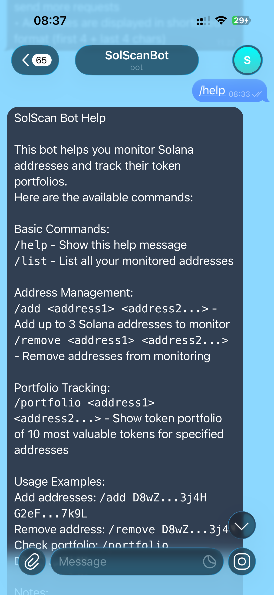
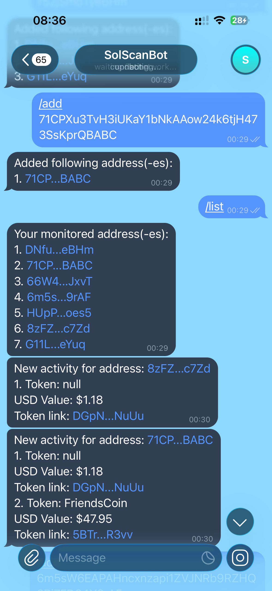
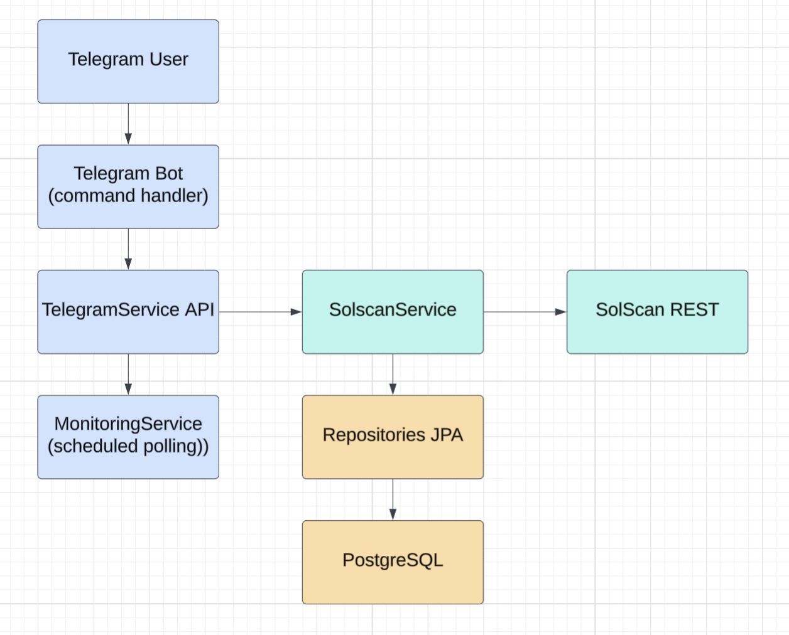
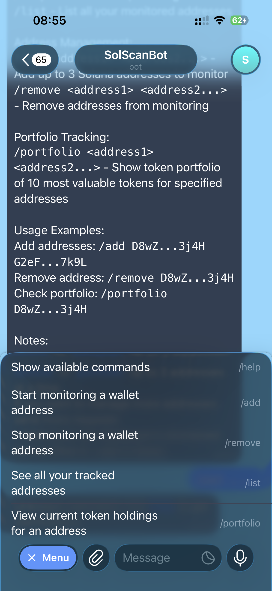

# SolScanBot 🤖

A Telegram bot (@solscan_notification_bot) that monitors Solana wallet addresses and notifies you about token balance activity
— powered by the SolScan API and built with Spring Boot. P.S. The bot is not active right now.

### Help 


### Add and list addresses 


### Get notified


---

## Features

- **Track Solana addresses** — add and remove wallet addresses to monitor via Telegram commands
- **Balance activity alerts** — get notified when token balances change on tracked addresses
- **Portfolio overview** — view current token holdings for any monitored address
- **Token metadata** — fetches token names, symbols, and on-chain metadata from SolScan
- **Scheduled monitoring** — background polling automatically checks for new activity
- **Persistent storage** — all monitored addresses and activity history saved to PostgreSQL
- **Address validation** — Solana address format verified before being accepted

---

## Tech Stack

| Layer | Technology |
|---|---|
| Runtime | Java 17+, Spring Boot |
| Bot framework | TelegramBots 6.1.0 |
| Database | PostgreSQL |
| Migrations | Liquibase |
| ORM | Spring Data JPA |
| Blockchain data | SolScan API |
| Build | Maven |

---

## Architecture Overview



---

## Database Schema

The application manages four tables, created automatically by Liquibase on startup:

- **`tokens`** — Solana token metadata (name, symbol, address)
- **`monitored_addresses`** — wallet addresses being tracked, linked to a Telegram chat ID
- **`balance_activities`** — historical record of balance changes per address/token
- **`address_token`** — many-to-many join between addresses and their tokens

---

## Getting Started

### Prerequisites

- Java 17 or higher
- PostgreSQL database
- A Telegram Bot token (from [@BotFather](https://t.me/BotFather))
- A [SolScan API](https://solscan.io/apis/) key

### Configuration

Create a `.env` file in the project root (the app will auto-import it):

```properties
TELEGRAM_BOT_TOKEN=your_telegram_bot_token
TELEGRAM_BOT_USERNAME=your_bot_username
SOL_SCAN_KEY=your_solscan_api_key

# Database
SPRING_DATASOURCE_URL=jdbc:postgresql://localhost:5432/solscanbot
SPRING_DATASOURCE_USERNAME=your_db_user
SPRING_DATASOURCE_PASSWORD=your_db_password
```

### Running the Application

```bash
# Using the pre-built JAR
java -jar solscanbot-0_0_1-SNAPSHOT.jar

# Or with Maven from source
./mvnw spring-boot:run
```

Liquibase will automatically run the database migrations on first startup.

---

## Bot Commands



| Command | Description |
|---|---|
| `/start` | Welcome message and usage instructions |
| `/add <address>` | Start monitoring a Solana wallet address |
| `/remove <address>` | Stop monitoring an address |
| `/list` | Show all currently monitored addresses |
| `/portfolio <address>` | View current token holdings for an address |

---

## Error Handling

The bot handles the following error cases gracefully:

- **Invalid address** — rejects malformed Solana addresses before adding them
- **Address already monitored** — prevents duplicate tracking entries
- **Address not found** — informs the user when trying to remove an untracked address
- **Too many addresses** — enforces a per-user address limit
- **No addresses yet** — friendly message when the user hasn't added anything

---

## Project Structure

```
ivan/solscanbot/
├── SolScanBotApplication.java       # Entry point
├── bot/
│   └── TelegramBot.java             # Command routing & message handling
├── service/
│   ├── TelegramServiceImpl.java     # User-facing bot logic
│   ├── SolScanServiceImpl.java      # SolScan API client
│   └── MonitoringService.java       # Scheduled balance checks
├── dto/
│   ├── internal/                    # Domain models (MonitoredAddress, Token, BalanceActivity)
│   └── external/                    # SolScan API response DTOs
├── repository/                      # Spring Data JPA repositories
├── mapper/                          # DTO ↔ entity mappers
├── verifier/                        # Solana address format validation
├── config/                          # Bot, scheduler, and mapper config
└── exception/                       # Custom exception classes
```

---

## Contributing

Pull requests are welcome! Please open an issue first to discuss larger changes.

---
